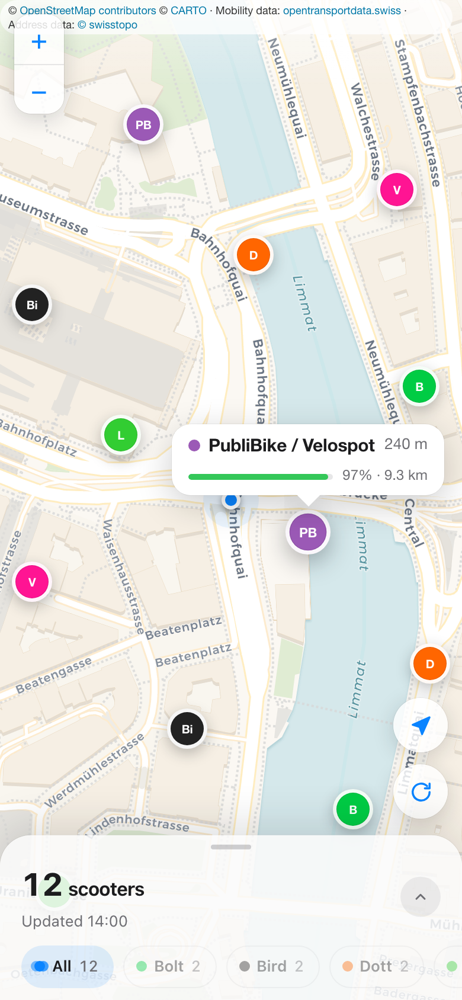

<p align="center">
  
</p>

<h1 align="center">Swiss Scooters</h1>

<p align="center">
  A friendly map for finding shared e-scooters in Switzerland and selected cities in France, Germany and Italy.
</p>

<p align="center">
  <a href="https://github.com/plhery/swiss-scooters/actions/workflows/ci.yml"></a>
  <a href="LICENSE"></a>
  
  
</p>

<p align="center">
  <a href="https://swiss-scooters.plhery.com"><strong>Open the live map →</strong></a>
</p>

<p align="center">
  
</p>

Swiss Scooters brings the national shared-mobility feed, Swiss address search,
provider and battery filters, and light/dark maps into one installable web app.
It speaks German, French, Italian, and English. There is also a native SwiftUI
app for iPhone.

**Supported providers:** Bolt, Bird, Dott, Hopp, Lime, Voi, Pony, and PubliBike / Velospot.

French coverage includes 27 verified feeds across 25 cities or operating areas,
with city-name search. German coverage adds 90 feeds across 86 cities (Dott, Bolt, Hopp, Lime and Voi); Italian coverage currently includes Bird in Rome. See the [German/Italian feed audit](docs/german-italian-scooter-feeds.md) for coverage and known gaps. See the [French feed investigation](docs/french-scooter-feeds.md)
for the city list, live-check command, and source terms to review before deployment.

## Run it locally

You need Node.js 26+ and npm.

```bash
git clone https://github.com/plhery/swiss-scooters.git
cd swiss-scooters
npm ci
npm run dev
```

Open [localhost:3000](http://localhost:3000). That is it—there are no required
environment variables, API keys, databases, or accounts.

To run the checks:

```bash
npm run check:providers
npm run check:api-contract
npm run lint
npm test
npm run test:e2e
npm run build
```

Provider metadata shared by the web and iPhone apps is generated from
`data/providers.json`; the same generator includes Swiss, French, German and Italian service-area
coverage for native provider filters. Run `npm run generate:providers` after
changing the provider or service-area catalogs.
The scooter API wire types are generated for both clients from
`data/scooter-api.schema.json`; run `npm run generate:api-contract` after
changing the response contract.

## Deploy your own

The included configuration targets Cloudflare Workers through OpenNext. Give
your fork a Worker name and hostname in `wrangler.jsonc`. Deploy the persistent
cache with `server/Dockerfile` and a `/data` volume, and set
`SCOOTER_SNAPSHOT_API_URL` to that origin. Then:

```bash
npx wrangler login
npm run deploy
```

See [DEPLOY.md](DEPLOY.md) for rate limits, previews, production checks, and
rollback notes.

## iPhone app

Open `ios/SwissScooters.xcodeproj` in Xcode 26+, choose a development team, and
run the `SwissScooters` scheme. More details are in [ios/README.md](ios/README.md).

## Data, privacy, and contributing

Scooter locations come from the
[Open data platform mobility Switzerland](https://data.opentransportdata.swiss/en/dataset/sharedmobility),
address search comes from swisstopo, and web map tiles come from OpenStreetMap.
The app stores no account or location history.

- [Data sources and attribution](DATA_SOURCES.md)
- [Privacy](PRIVACY.md)
- [Contributing](CONTRIBUTING.md)
- [Security](SECURITY.md)

Swiss Scooters is open source under the [MIT License](LICENSE). Come build with us.

Published operator parking bays appear as **P** markers at street zoom. Tap a bay
for the provider, published parking requirement and directions. Closed return
locations are removed when the operator publishes that status. Coverage depends
on the operator's public feed; check its app before ending a ride.
